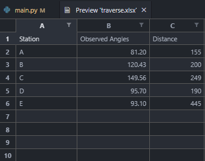
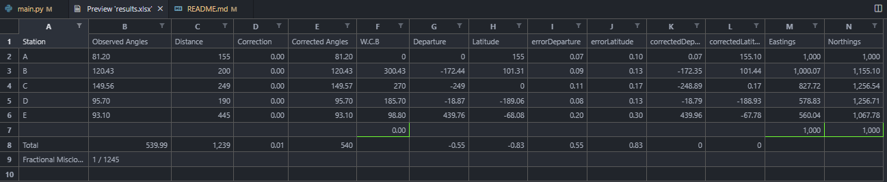

# Closed-Loop Traversing Computation with python-Openpyxl 

A python script that calculate the Northings, Eastings, Latitude and Longitude of points given the Included Angles of the Points and the Distances between them.

I used the Bowditch Method to adjust for the Depature and Latitude

## The inputed excel sheet should look like the image below

## The outputted excel will be named **results.xlsx** and its contents will be as below

